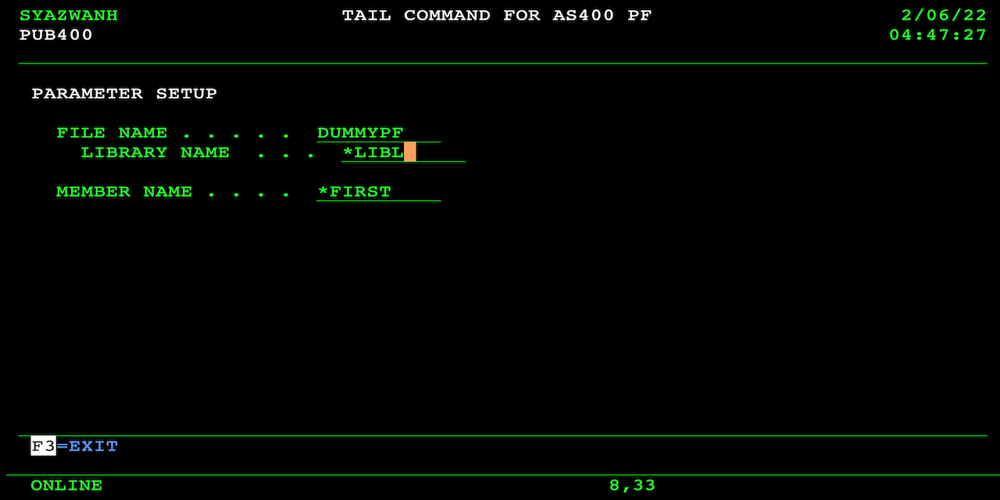
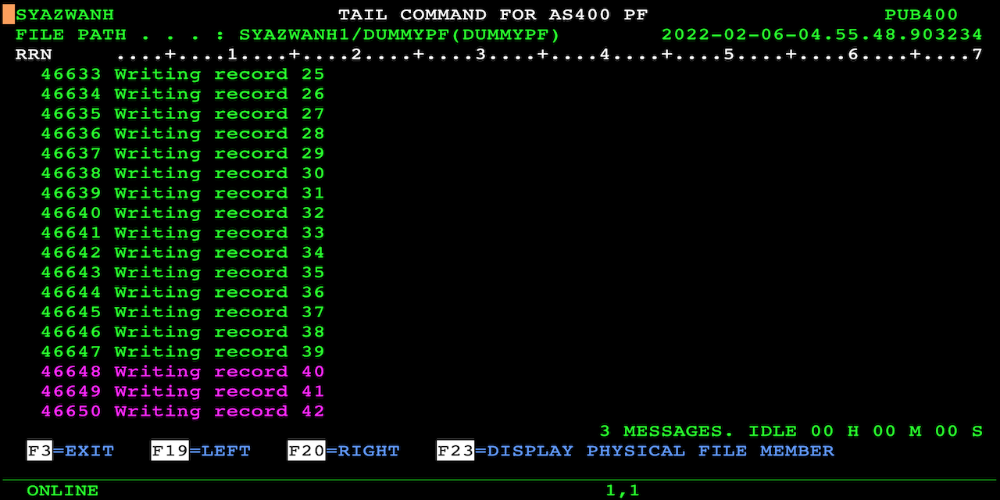

# AS400 File Monitoring Utility
Monitors a physical file like Unix tail command. Auto refresh the display and show new records.

## Introduction
This tool was written out of frustration when required to repeatedly hit Enter key on DSPPFM command while monitoring log files (PF-DTA) for incoming transactions. I wrote this for me but I hope it will benefit you too.

## How to Compile
First, upload the source to your AS/400 using FTP or other similar means, then set the correct source type for each member:
1. PVFMONUSR RPGLE
2. PVFMONUSU C
3. PVFMONUSD DSPF

Compile the DSPF first using option 14. Then the RPGLE and C using option 15. Finally, issue CRTPGM PGM(PVFMONUSR) MODULE(PVFMONUSR PVFMONUSU). If you run into any difficulties with the source code, please verify that:
1. The source physical file ('PF') is at least 112 in length, for example, CRTSRCPF FILE(QRPGLESRC) RCDLEN(112).
2. The code page of the PF and your job is 37, for example, CHGJOB CCSID(37).
3. The FTP mode of transfer was set to ASCII during upload.

## Running the Program
CALL PVFMONUSR.

Enter the file, library and member of the PF-DTA you wish to monitor. Press Enter. If your LIB/FILE,MBR path is valid, the screen will load and the navigation keys are displayed at the bottom of the display.

When new entries are written to the monitored file, the display will refresh and highlight those new entries. Timer at bottom right of the screen indicates how long it's been since new entries were found. You can navigate left/right (like DSPPFM) if your records are longer.

## Additional Notes
You will require ILE C compiler in addition to RPG and DDS. The program will always read last record entry, so if your file is not sequential or if your PF make use of REUSEDLT, then this program is not for you. Program was written in Free-Format RPG.
